# Beyond Emergency Lighting: Passive Visual Guidance Systems in Offshore, Marine, Energy and Industrial Facilities

**Author:** Alan Friar, B.Sc. Electrical Engineering  
**ORCID:** [0009-0000-6986-1771](https://orcid.org/0009-0000-6986-1771)  
**Keywords:** Offshore/Onshore Safety, Emergency Lighting, Passive Visual Guidance, Human Factors, Degraded Visibility, FPSO, Evacuation, Asset Recognition.

> **NOTICE TO REVIEWERS**
> This paper does not propose new standards, regulations, design requirements, risk assessment methodologies, or operational procedures. The intention is to encourage discussion regarding the potential role of passive visual guidance systems as a supplementary measure within offshore, marine, and energy facilities. The observations presented are based upon established industry practices, existing guidance documents, and practical engineering experience within offshore and marine environments. Decisions regarding implementation remain the strictly held responsibility of facility owners, operators, engineering organisations, and regulatory authorities.

## Abstract
Modern offshore, marine, and energy facilities employ multiple layers of protection intended to support personnel safety during both normal and abnormal operating conditions. These typically include primary lighting systems, emergency lighting systems, battery-backed power supplies, emergency generators, safety signage, public address systems, general alarm systems, and established emergency response procedures. Despite these robust protections, practical visibility challenges continue to exist. Structural obstructions, process equipment density, severe weather conditions, smoke, steam, power-related events, and human factors can all degrade an individual's ability to identify escape routes, access emergency equipment, and locate critical assets during abnormal operating conditions.

This paper examines the potential role of passive visual guidance systems within these complex industrial environments. Particular consideration is given to escape routes, stairways, muster stations, lifeboat embarkation points, firefighting equipment, medical response stations, emergency shutdown (ESD) locations, helidecks, and marine transportation interfaces.  

By reviewing existing industry practices, relevant standards, and precedents from the transportation, aviation, maritime, and mining industries, this document explores how visual guidance systems are routinely employed to improve navigation and situational awareness.  

The objective is not to advocate for any specific proprietary product or technology, nor to replace existing lighting philosophies. Rather, the paper explores whether passive visual guidance systems may provide a valuable, supplementary layer of cognitive and visual support, and whether further evaluation within the energy and marine sectors is warranted.

---

## 1. Introduction
The offshore, marine, and energy industries have invested heavily in safety over recent decades. Improvements in engineering design, safety management systems, emergency response planning, personnel training, and equipment reliability have contributed significantly to reductions in accidents and incidents throughout the sector. Lighting systems have formed a vital component of this evolution. Modern facilities incorporate carefully engineered lighting schemes designed to support operational activities, maintenance tasks, inspections, and emergency response requirements. Emergency lighting systems, battery-backed power supplies, and emergency power generation systems provide additional layers of protection intended to maintain safe conditions during abnormal events.

However, visibility remains a highly complex issue. Engineering calculations can determine illumination levels, standards can specify minimum lux/lumen requirements, and project specifications can define strict performance criteria. Yet, the ability of personnel to identify routes, recognise hazards, and locate critical equipment is influenced by a much wider range of factors.  

The distinction between illumination and visibility is critical: a facility may comply fully with all lighting requirements while still presenting severe visibility challenges resulting from structural obstructions, equipment density, glare, visual clutter, or cognitive human factors.

This paper explores whether passive visual guidance systems may provide additional support under such conditions. This discussion is not intended to replace existing lighting philosophies or emergency response procedures, but rather to consider whether passive systems may complement existing measures by improving the recognisability of routes and critical assets.

## 2. Visibility Challenges in Complex Facilities
Industrial facilities present visibility challenges rarely encountered in conventional commercial environments. Floating production facilities, such as FPSOs, FSOs, and FLNGs, alongside offshore platforms, refineries, and marine terminals, are highly congested spaces. Process equipment, utility systems, structural steelwork, pipe racks, and cable routing systems compete for limited physical space across multiple deck levels.

During the engineering phase, lighting designers attempt to account for these features. Sophisticated 3D modelling tools allow engineers to evaluate illumination levels and optimise luminaire placement. Despite these capabilities, practical limitations remain. Large items of equipment inevitably create shadows, pipework obstructs direct light paths, and structural members reduce visibility at specific viewing angles.

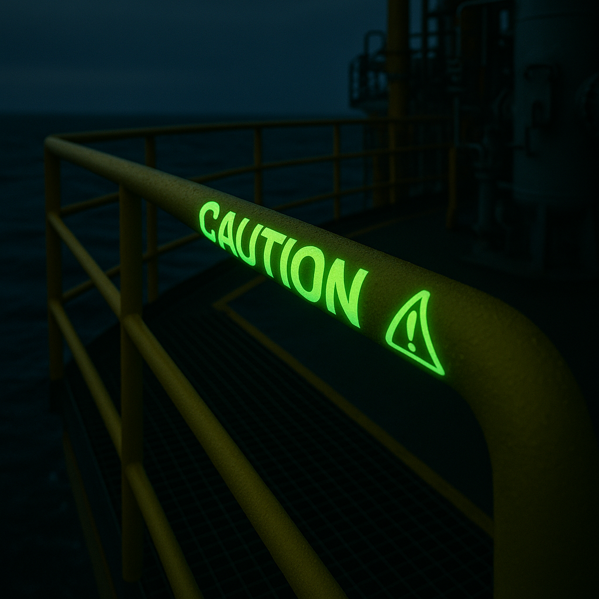
*Figure 1: A passively marked handrail on an offshore facility, illustrating how supplementary visual cues remain recognisable independent of ambient lighting conditions.*

Furthermore, temporary equipment, scaffolding, and maintenance activities frequently alter conditions post-installation. For instance, a fully compliant bulkhead luminaire may cast a hard shadow across a critical stair nosing simply because a temporary scaffolding pipe or a newly routed cable tray was installed after the initial commissioning. The result is that visibility within a facility is often more complex than computational lighting models suggest.

Environmental and operational conditions introduce further challenges. Facilities operate continuously, exposing personnel to rain, fog, sea spray, dust, and varying weather conditions that influence visual contrast. Emergency situations compound these issues; personnel responding to alarms must process information rapidly, locate emergency equipment, and proceed towards muster stations while simultaneously responding to evolving circumstances. Under such elevated stress, rapid recognition of visual information becomes increasingly critical.

## 3. Existing Emergency Response Philosophies
Modern offshore and marine facilities employ multiple, overlapping layers of protection. These typically operate in a descending hierarchy:

1. Normal operational lighting
2. Emergency lighting systems
3. Battery-backed systems / UPS
4. Emergency power generation
5. Illuminated signage and General Alarm systems
6. Established muster and evacuation procedures

On offshore facilities, emergency response frequently prioritises personnel accountability and incident assessment before evacuation becomes necessary. A typical sequence involves alarm activation, personnel movement towards designated muster stations, accountability checks, incident assessment, decision-making, and, only if required, evacuation.

This layered philosophy has proven highly effective and remains fundamental to offshore safety management. The discussion of passive visual guidance systems within this paper must be viewed entirely within the context of these existing protections. Passive visual guidance systems are not proposed as replacements for any tier of this hierarchy, but rather as possible supplementary aids.

## 4. Degraded Visibility Conditions
Degraded visibility may arise from numerous operational or emergency causes. Power-related events represent a primary concern; although emergency systems are intended to maintain safe conditions, facilities may experience reduced illumination during power transitions, equipment failures, or extreme abnormal events. Fire events generate smoke, high-pressure releases generate steam, and severe weather reduces ambient contrast.

Importantly, "degraded visibility" does not necessarily imply total darkness. More commonly, it represents a reduction in the quality, clarity, or availability of visual information. Personnel may still be able to generally perceive their surroundings while simultaneously finding it difficult to quickly identify specific escape routes, equipment interfaces, or operational features. Under such ambiguous conditions, additional passive visual references offer significant potential value.

## 5. Passive Visual Guidance Systems vs. Illumination
Passive visual guidance systems encompass a wide range of technologies, including photoluminescent materials, reflective surfaces, contrasting colour systems, and delineation markings, intended to improve visual recognition without reliance upon active electrical power.

The common objective of these systems is not illumination; the objective is recognition. The goal is to provide the visual reference necessary to identify a route, locate equipment, and confidently navigate a complex environment. This distinction is paramount: lighting systems provide illumination, whereas passive systems provide visual reference. The two functions address different cognitive needs and are inherently complementary.

## 6. Targeted Application Areas
While passive systems have broad potential, several specific applications within offshore and marine environments warrant particular consideration:

### 6.1 Escape Routes and Personnel Movement
During abnormal operating conditions, personnel must move through facilities safely and efficiently. While escape route signage already exists, passive visual enhancement, applied to route delineation, directional indicators, stair nosings, handrails, and landings, can reinforce visual information already available, creating a continuous visual line that is easier to follow when sightlines to traditional overhead signage are obstructed.

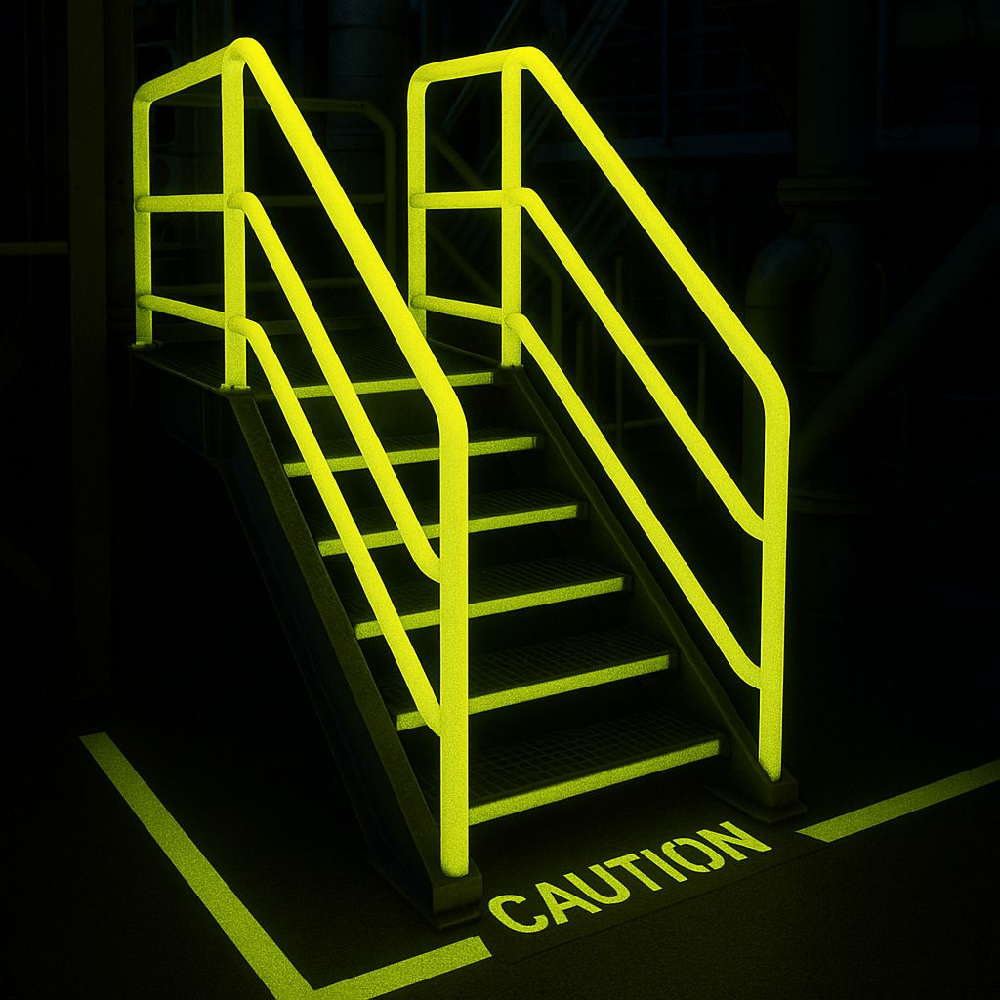
*Figure 2: A stairway enhanced with continuous passive visual guidance along handrails and step nosings, reinforcing route recognition independent of overhead lighting.*

### 6.2 Muster Stations and Accountability
Because muster and personnel accountability form the primary response to offshore emergencies, the ability to rapidly identify muster locations is critical. Passive guidance systems can assist with muster station recognition and access route identification, which is particularly relevant for visitors, contractors, and personnel less familiar with the facility layout.

### 6.3 Survival Equipment and Embarkation
Lifeboats, liferafts, and associated embarkation areas become critically important during severe emergencies. Enhancing the access routes, embarkation deck areas, and the identification of safety equipment controls with passive visual markers may improve recognition and reduce loading times under degraded visibility conditions.

### 6.4 Emergency Response and Firefighting
Fire response equipment (extinguishers, hose reels, firewater valves, deluge controls) may remain unused for extended periods until urgently required. Passive visual enhancement provides an additional layer of identification, ensuring that personnel can rapidly locate these assets even if primary illumination is compromised by smoke or steam.

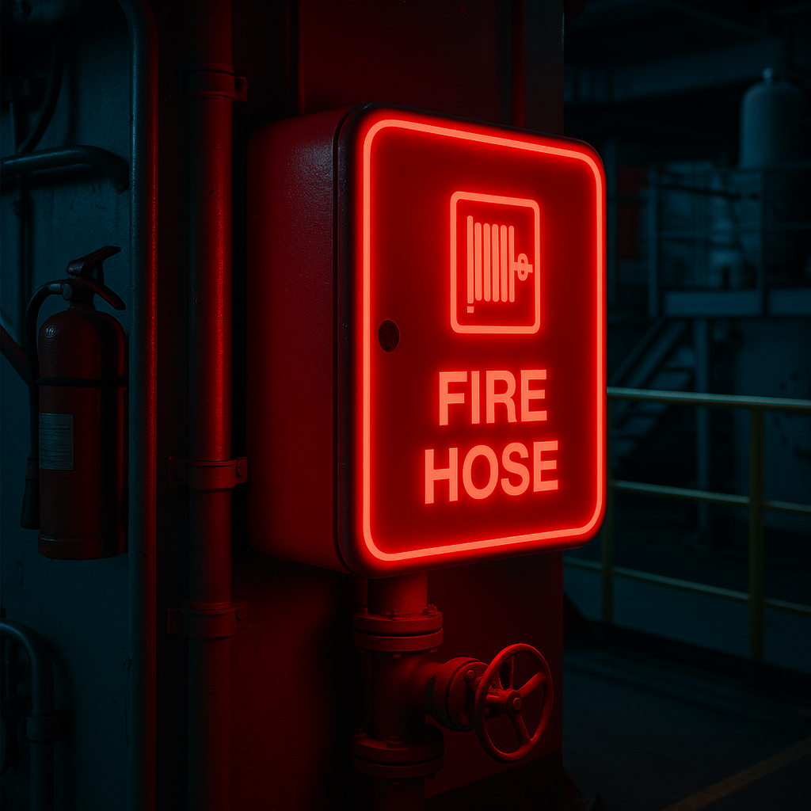
*Figure 3a: A firewater hose station identified through passive visual signage under degraded lighting conditions.*

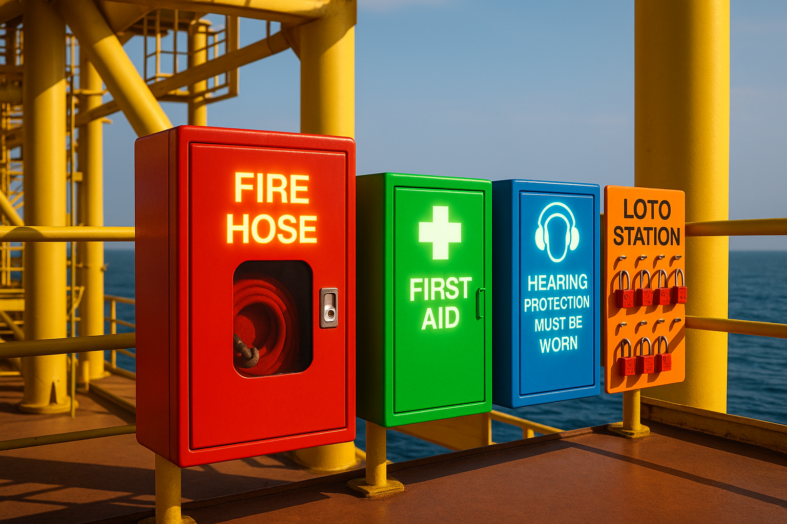
*Figure 3b: The same category of emergency response assets under daylight conditions, illustrating that passive visual coding functions as a consistent day/night reference rather than a night-only measure.*

### 6.5 Medical Response Facilities
Eyewash stations, safety showers, and first aid facilities require immediate identification following chemical exposure or personnel injury. In scenarios where delays are measured in seconds, supplementary visual references can significantly assist personnel in locating relief stations.

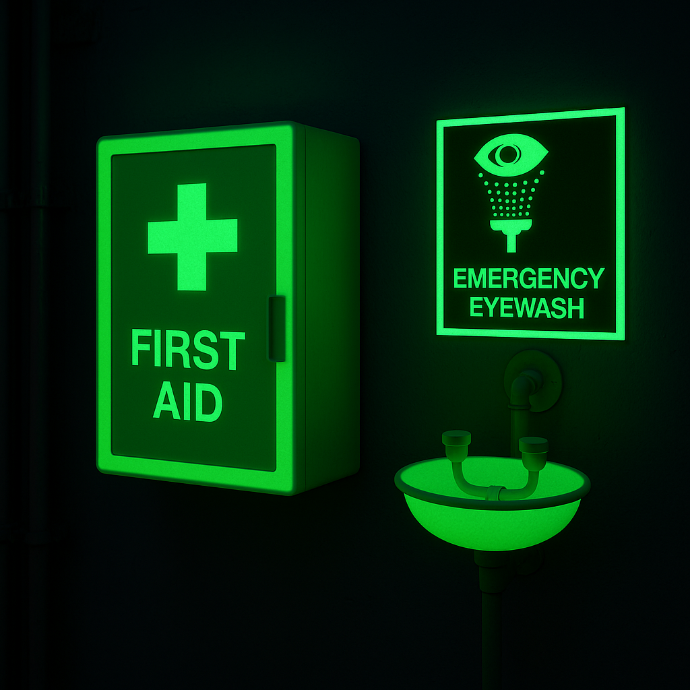
*Figure 4: First aid and emergency eyewash facilities identified through passive visual signage, supporting rapid recognition during time-critical medical response.*

### 6.6 Emergency Shutdown (ESD) Stations
Emergency shutdown stations and isolation points are designed to place equipment into safe states. The ability to rapidly identify ESD stations, manual call points, and emergency communication interfaces is vital during incident escalation.

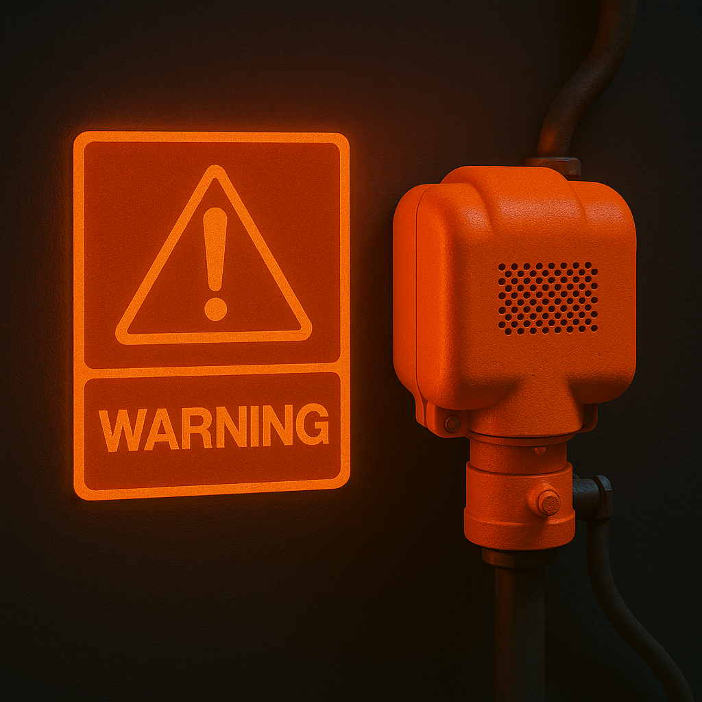
*Figure 5: Passive warning signage adjacent to an isolation point, supporting rapid hazard recognition consistent with the intent of ESD and manual call point identification.*

### 6.7 Helidecks and Aviation Interfaces
Offshore helicopter operations rely heavily upon visual references, and normal operations are governed by strict standards (e.g., CAP 437). However, under power loss or emergency conditions, passive visual references applied to access routes, emergency firefighting equipment, and operational interfaces around the helideck perimeter could provide supplementary situational awareness for both flight crews and helideck response teams.

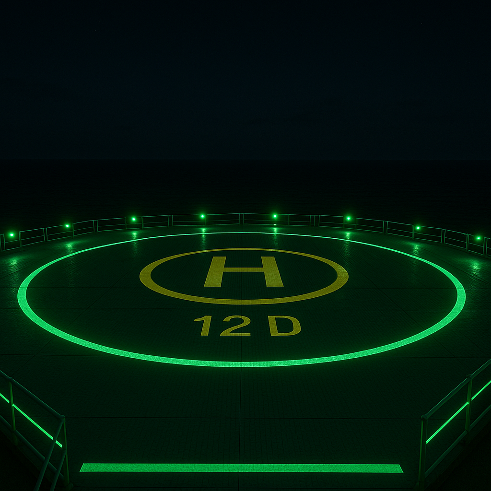
*Figure 6: A helideck touchdown circle and perimeter enhanced with passive visual guidance, illustrating supplementary reference points independent of active lighting systems.*

### 6.8 Marine Terminals and Dock Facilities
Shore-based marine facilities present similar visibility challenges. Dock edges, quay walls, gangways, and crane access routes benefit from visual markings. Enhanced visibility of these access routes contributes to improved situational awareness during night operations and heavy weather cargo handling.

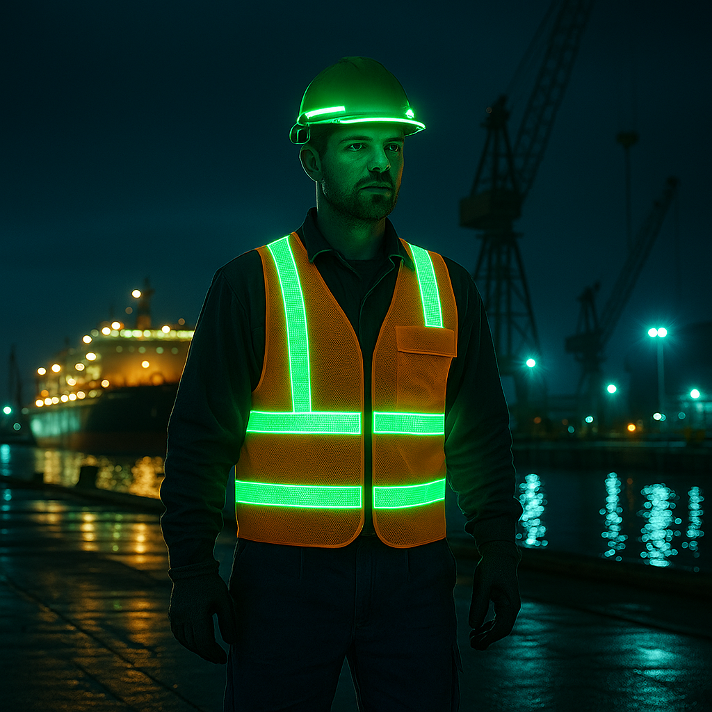
*Figure 7: Passively enhanced personal protective equipment supporting individual visibility and recognition during night operations at a marine terminal.*

### 6.9 Shipyards and Dry Dock Facilities
Shipyards and dry dock facilities present a distinct set of visibility challenges, separate from both offshore platforms and active marine terminals. Vessels undergoing construction, repair, or maintenance are typically positioned within a drained dock basin, surrounded by perimeter walkways, crane rail tracks, and long linear personnel access routes. These facilities frequently operate extended shifts, including night and low-light working hours, where personnel must transit substantial distances along consistent, well-defined paths between work areas, staging zones, and emergency egress points. Passive visual guidance applied to dock perimeter edges, crane track boundaries, stairway nosings, and directional deck markings can reinforce route continuity across these long transit distances, while emergency exit identification at dockside facilities benefits from the same recognition principles discussed in Section 6.1.

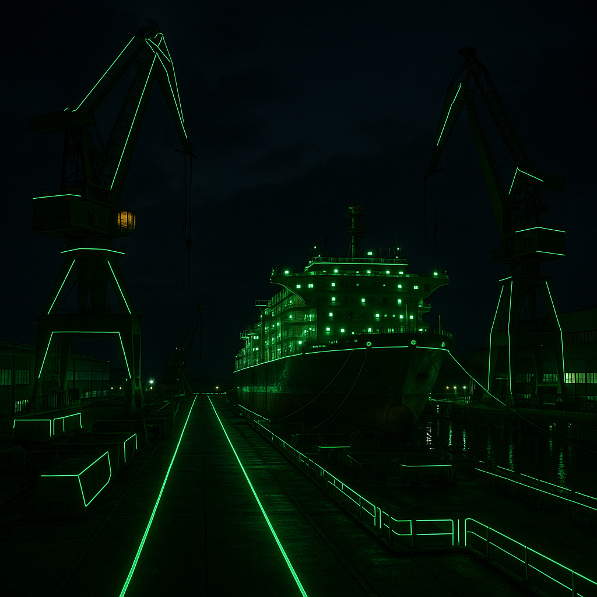
*Figure 8: A vessel in dry dock, with perimeter walkways and crane track boundaries reinforced through passive visual guidance, supporting route continuity around the drained dock basin.*

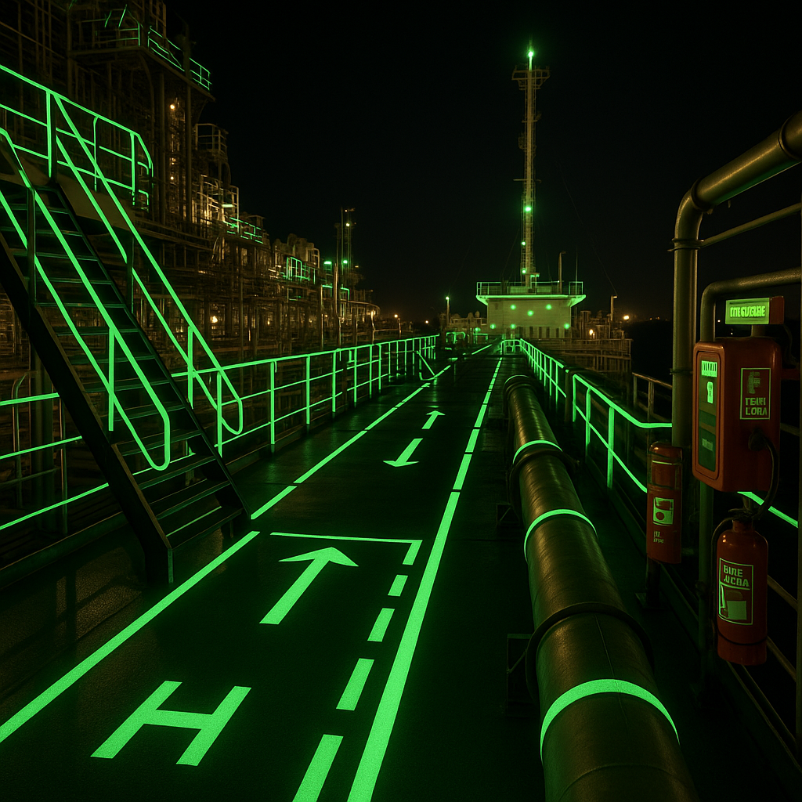
*Figure 9: Directional passive guidance lines supporting personnel movement along extended shipyard transit routes between cranes and vessel access points.*

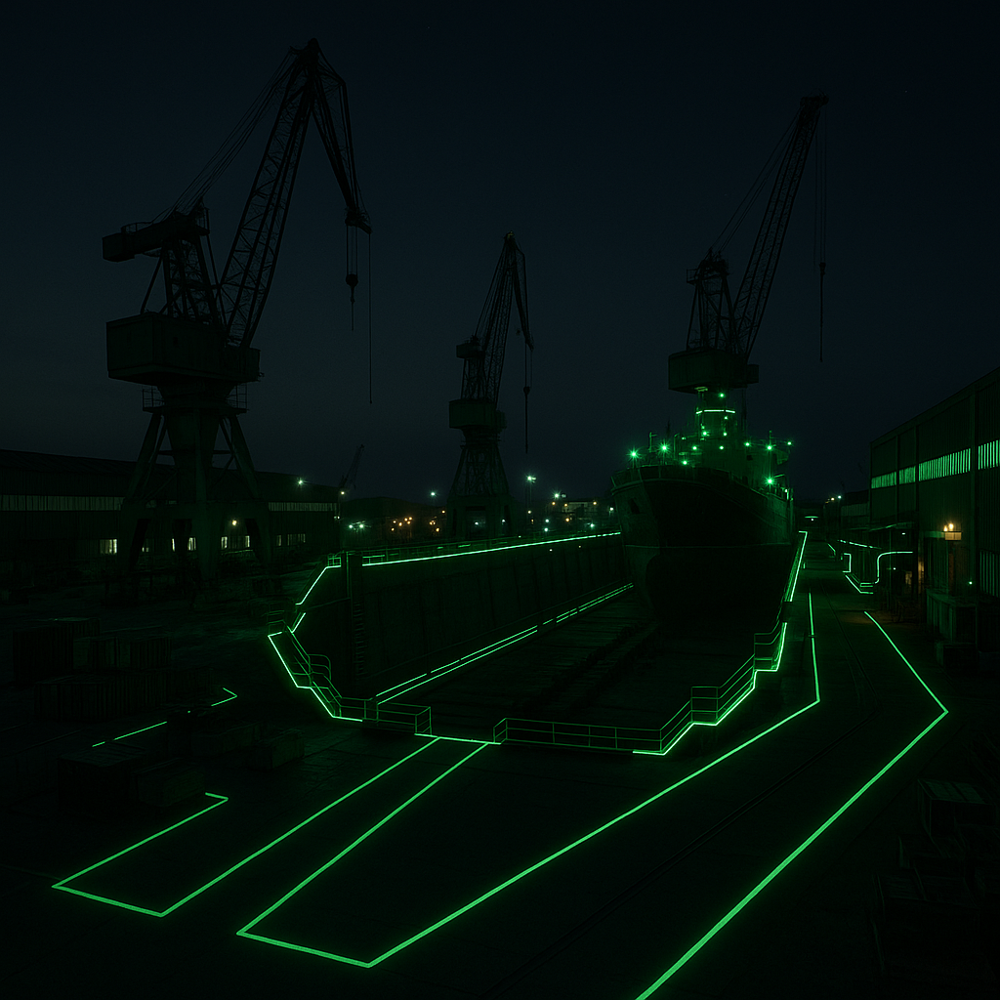
*Figure 10: A vessel deck walkway combining directional passive markings, stairway delineation, and firefighting equipment identification, illustrating the layered application of passive guidance aboard a docked vessel.*

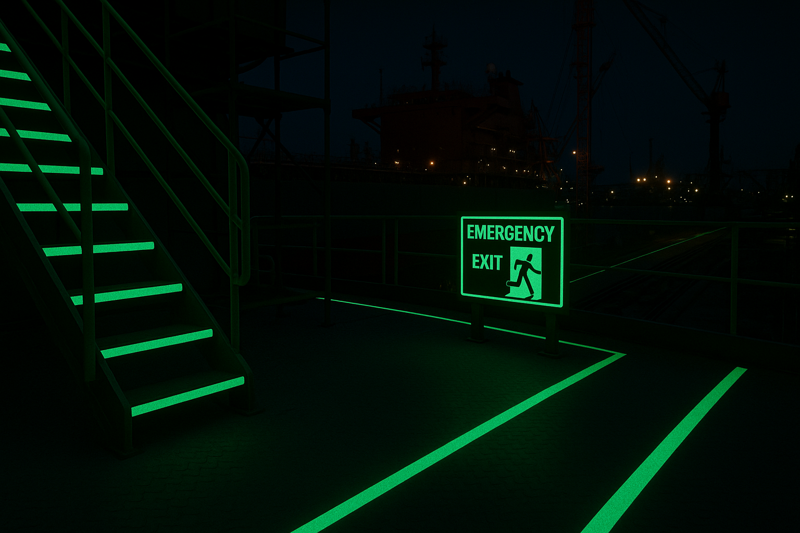
*Figure 11: A dockside stairway and emergency exit identified through passive visual signage during night shift operations, consistent with the escape route principles discussed in Section 6.1.*

## 7. Human Factors and Situational Awareness
Engineering discussions frequently focus heavily upon equipment and compliance, yet emergency response ultimately depends upon human cognition. The ability of personnel to recognise, interpret, and act upon information is the foundation of safety performance.

During emergency situations, personnel experience spiked cognitive workload, stress, and urgency. Research across numerous industries demonstrates that personnel perform more effectively when environmental ambiguity is reduced. Clear, continuous visual information helps lower cognitive load. The objective of passive visual guidance systems is not to replace training or operational experience, but to reinforce spatial awareness, reducing the mental processing required to navigate a congested space safely.

## 8. Lessons from Allied Industries
Numerous industries already successfully employ multi-layered visual guidance systems:
* **Road Transportation:** Employs lane markings, reflective signs, and delineators to assist drivers, despite vehicles possessing headlights and roads possessing overhead illumination.
* **Aviation:** Utilises runway markings, taxiway delineation, and threshold markings to support highly trained flight crews equipped with sophisticated instrumentation.
* **Maritime & Mining:** Employs low-location lighting, escape route marking systems, and refuge station identification in harsh, visually restrictive environments.

These examples do not dictate direct equivalence for offshore use, but they demonstrate a universal human-factors principle: visual guidance systems are widely employed across high-risk industries because robust visual recognition remains a fundamental component of human safety and navigation.

## 9. Standards and Guidance Framework
The offshore, marine, and energy sectors operate within a comprehensive framework of standards. The purpose of exploring passive visual guidance systems is not to reinterpret or bypass these documents. Instead, it seeks to identify the operational gaps where passive visual guidance systems may securely complement these existing practices, ensuring facilities not only meet the code on paper but function intuitively for the personnel on deck. Relevant documents governing these spaces include regulations on hazardous areas (IEC 60079 series), emergency lighting (ISO 30061, EN 1838), safety signage (ISO 7010, ISO 3864, ISO 16069), offshore installations (IEC 61892), and maritime safety (SOLAS).

## 10. Lifecycle, Maintenance, and Reliability
Any discussion regarding passive visual systems must address lifecycle performance. Offshore and marine environments are highly demanding; constant exposure to ultraviolet (UV) radiation, salt spray, extreme temperature fluctuations, mechanical damage, and drilling contamination will influence long-term material performance.

Passive systems cannot be treated as "install and forget" solutions. Their effectiveness depends entirely upon maintaining adequate contrast and luminance. Consequently, future evaluations of these systems must consider integration into existing facility wash-down routines and standard visual inspection cycles to ensure they remain operationally viable throughout their intended service life.

## 11. Discussion and Future Opportunities
The offshore, marine, and energy industries achieve safety improvements through continuous, incremental refinement rather than isolated, disruptive innovations. The concept of passive visual guidance systems aligns perfectly with this philosophy.

This discussion does not suggest deficiencies in existing emergency systems, nor does it advocate the replacement of established lighting philosophies. Instead, it posits that supplementary visual references provide tangible support under specific degraded conditions. The exact application will inevitably vary between facilities, operators, and environments.

Numerous opportunities exist for objective, non-commercial evaluation, including human factors assessments, route recognition exercises during emergency response drills, and offshore field trials. Such evaluations will help develop a clearer understanding of the circumstances under which passive visual guidance systems provide measurable value, and equally, where they offer limited benefit.

## 12. Conclusions
Modern offshore, marine, and energy facilities employ extensive, well-engineered systems intended to support personnel safety. Normal lighting, emergency illumination, backup power, and strict operational procedures continue to provide the bedrock for safe operations.

Nevertheless, visibility challenges remain a practical, unavoidable reality within complex industrial environments. This paper has examined the potential role of passive visual guidance systems as a supplementary measure capable of enhancing route identification, asset recognition, and situational awareness when standard visual cues are degraded by obstructions, weather, or emergencies.

The objective has not been to advocate for specific products, create new standards, or introduce proprietary methodologies. Rather, the purpose is to encourage rigorous professional discussion. If passive visual guidance systems can incrementally assist personnel in identifying safe routes, locating critical equipment, and improving situational awareness during abnormal operating conditions, then further evaluation by facility operators and engineering organisations is undoubtedly justified.

---

## References & Bibliography
1. Civil Aviation Authority (CAA). *CAP 437: Standards for Offshore Helicopter Landing Areas.*
2. International Civil Aviation Organization (ICAO). *Annex 14 to the Convention on International Civil Aviation: Aerodromes.*
3. International Electrotechnical Commission (IEC). *IEC 61892: Mobile and fixed offshore units – Electrical installations.*
4. International Electrotechnical Commission (IEC). *IEC 60079: Explosive atmospheres.*
5. International Maritime Organization (IMO). *SOLAS: International Convention for the Safety of Life at Sea.*
6. International Maritime Organization (IMO). *Resolution A.752(18): Guidelines for the Evaluation, Testing and Application of Low-Location Lighting on Passenger Ships.*
7. International Organization for Standardization (ISO). *ISO 3864: Graphical symbols - Safety colours and safety signs.*
8. International Organization for Standardization (ISO). *ISO 7010: Graphical symbols - Safety colours and safety signs - Registered safety signs.*
9. International Organization for Standardization (ISO). *ISO 16069: Graphical symbols - Safety signs - Safety way guidance systems (SWGS).*
10. International Organization for Standardization (ISO). *ISO 30061: Light and lighting - Emergency lighting.*
11. European Standards (EN). *EN 1838: Lighting applications - Emergency lighting.*

---

## Author Biography
**Alan Friar** is an Electrical Engineer and the Founder and CEO of EnBra Group. With over 35 years of professional experience across the global oil and gas industry, spanning operations in Houston, Brazil, and internationally, his expertise is grounded in the practical execution of complex offshore systems. Alan has extensive field and design experience, notably serving as the Lead Electrical Engineer on the turret systems for the highly complex MODEC Culzean development. His work focuses on bridging the gap between theoretical engineering compliance and the physical, operational realities faced by personnel on offshore and marine facilities.

---

## License and Citation
**License:** This work is licensed under a [Creative Commons Attribution 4.0 International License (CC BY 4.0)](https://creativecommons.org/licenses/by/4.0/). You are free to share, copy, and redistribute the material in any medium or format, and adapt the material for any purpose, even commercially, provided appropriate credit is given.

**How to Cite this Paper:**
> Friar, A. (2026). *Beyond Emergency Lighting: Passive Visual Guidance Systems in Offshore, Marine, Energy and Industrial Facilities*. GitHub Repository / Zenodo. [Insert DOI/URL when published]
